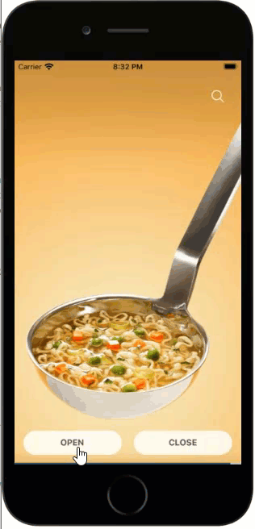
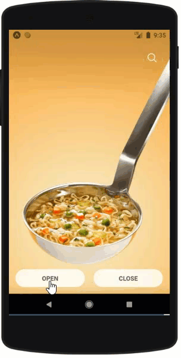

# React Native - Animated Searchbox  
A simple search box with animation. Compatible with Expo CLI and React Native CLI.  
  
* Easy to use,  
* Lightweight, fast, flexible and easy customizable,  
* Support both IOS & Android Devices,  
* Also Support React Native Web  
  
  
## Install  
We used a search SVG icon in this project.   
So, you need to install the [React Native SVG](https://github.com/react-native-community/react-native-svg#installation) library before continue the installation.   
  
After that;  
  
```  
npm install react-native-animated-searchbox --save  
  
//or  
  
yarn add react-native-animated-searchbox  
```  
  
## Demo  
#### SNACK EXPO IO
[https://snack.expo.io/@gurayyarar/react-native---animated-searchbox](https://snack.expo.io/@gurayyarar/react-native---animated-searchbox)

#### EXPO APP ON ANDROID


#### AS GIF (FOR QUICK CHECK)

|IOS|ANDROID|WEB|
|---|-------|---|  
||||  
  
  
## Usage  
```  
//Call for the open  
openSearchBox = () => this.refSearchBox.open();  
  
//Call for the close  
closeSearchBox = () => this.refSearchBox.close();  
  
render() {  
 return ( 
    <View>
  
        <ReactNativeAnimatedSearchbox 
            ref={(ref) => this.refSearchBox = ref} 
            placeholder={"Search..."} 
        />
         
    </View>  
 )}  
  
```  
  
## Properties  
| Key                  | Description                                                                             | Value Type                        | Is Required | Default                   |  
|----------------------|-----------------------------------------------------------------------------------------|-----------------------------------|-------------|---------------------------|  
| height               | Height of the search box                                                                | ``number``                       | false       | 48                        |  
| borderRadius         | Border radius of the search box                                                         | ``number``                       | false       | 48                        |  
| fontSize             | Font size of the search box                                                             | ``number``                       | false       | 20                        |  
| backgroundColor      | Background color of the search box                                                      | ``color codes (hex,rgb,rgba)``                  | false       | rgba(255,255,255,0.70) |  
| placeholderTextColor | Placeholder text color                                                                  | ``color codes (hex,rgb,rgba)``                  | false       | #555555                  |  
| searchIconSize       | Search icon width and height size                                                       | ``number``                       | false       | 20                        |  
| searchIconColor      | Search icon color                                                                       | ``color codes (hex,rgb,rgba)``                  | false       | #555555                  |  
| focusAfterOpened     | If true, keyboard will show after search box opened                                     | ``boolean``                      | false       | false                     |  
| shadowColor          | Box\-shadow color of the search box\. If you don't want to please type ``transparent``  | ``color codes (hex,rgb,rgba)``                  | false       | rgba(0,0,0,0.12\)       |  
| placeholder          | Placeholder text of the search box                                                      | ``string/text``                  | true        |                           |  
| animationSpeed       | Animation speeds as miliseconds                                                         | ``array ([number, number])`` | false       | [200, 250] |  
  
And also supporting props all of the [TextInput Component of React Native](https://reactnative.dev/docs/textinput).  
  
  
## Events  
|Key|Description|  
|---|-----------|  
|onOpening|Trigger on search box start to open|  
|onClosing|Trigger on search box start to close|  
|onOpened|Trigger on search box fully opened|  
|onClosed|Trigger on search box fully closed|  
  
And also supporting events all of the [TextInput Component of React Native](https://reactnative.dev/docs/textinput).  
  
  
## FAQ  
**Can I use this template for personal or commercial websites/web projects?** Sure, you can use both of personal and commercial websites/web projects.  
  
**Is the attribution link required?** No, not required. (Though very much appreciated)  
  
  
## License  
**React Native - Animated Searhbox** is an open source project that is licensed under the [MIT license](http://opensource.org/licenses/MIT).  
  
  
## Credits  
* [Unsplash](https://unsplash.com/) - Beautiful, free images and photos that you can download and use for any project.  
* [Ionicons](https://ionicons.com/) - Premium designed icons for use in web, iOS, Android, and desktop apps.  
  
  
## Donations  
Donations are **greatly appreciated!**  
  
**[BUY ME A COFFEE](http://bit.ly/2yEjtx5)**